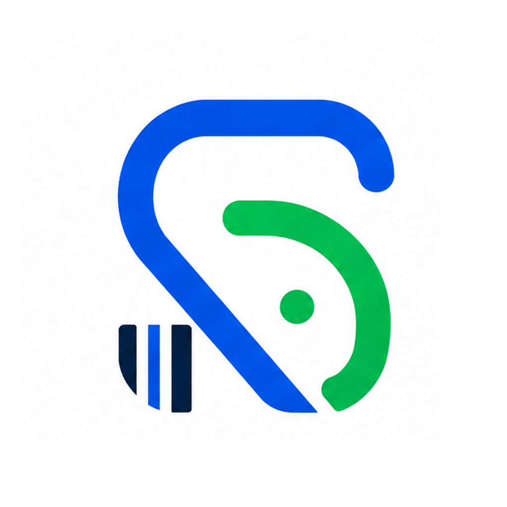

<div align="center">



# SimpliPos

**Offline inventory & point-of-sale management, built with Flutter.**

</div>

---

SimpliPos is a fully offline inventory and point-of-sale app for small shops.
Everything — products, stock, sales, and reports — lives in a local SQLite
database on the device, so it works with no internet connection and no
backend to run.

## Features

- **Dashboard** — at-a-glance view of stock levels, low-stock alerts, and
  recent activity.
- **Point of Sale** — build a cart, apply discounts, checkout, print/share a
  receipt, and hold sales to resume later.
- **Products & Categories** — full CRUD with photos, barcodes, and
  category-based organization. Categories in use can't be deleted out from
  under their products.
- **Stock In / Stock Out** — record inventory movements with full history per
  product (cascades away cleanly if the product is deleted).
- **Barcode scanning** — use the camera to look up or add products and to
  ring up items at checkout.
- **Reports** — sales reports over a chosen date range, exportable to Excel.
- **Backup & Restore** — export the database and product photos to a single
  zip file, and restore from one. Manual and auto backups are listed in
  separate tabs; auto backup runs on a user-configurable interval (seconds or
  minutes) and keeps only the most recent 10, evicting the oldest.
- **App Lock** — optional 6-digit PIN gate on launch (hashed at rest, never
  stored in plain text).
- **About** — app branding, a short description, and a version history of
  shipped features, reachable from the drawer.
- **Light & dark themes**, Material 3 throughout.

## Tech stack

| Concern            | Choice                                    |
|---------------------|-------------------------------------------|
| Language / UI       | Flutter, Material 3                       |
| State management    | [`provider`](https://pub.dev/packages/provider) |
| Navigation          | [`go_router`](https://pub.dev/packages/go_router) (`StatefulShellRoute` bottom-nav shell) |
| Local storage       | [`sqflite`](https://pub.dev/packages/sqflite) |
| Barcode scanning    | [`mobile_scanner`](https://pub.dev/packages/mobile_scanner) |
| Backup format        | zip (db + photos) via [`archive`](https://pub.dev/packages/archive) |
| Report export       | [`excel`](https://pub.dev/packages/excel) |

The app targets Android, iOS, Windows, macOS, and Linux from one codebase.

## Getting started

### Prerequisites

- [Flutter SDK](https://docs.flutter.dev/get-started/install) (Dart SDK `^3.12.2`)
- A connected device/emulator, or a desktop toolchain (Android Studio / Xcode
  / Visual Studio) for the platform you want to run

### Run it

```bash
flutter pub get
flutter run
```

### Build a release

```bash
flutter build apk        # Android
flutter build ios        # iOS
flutter build windows    # Windows
flutter build macos      # macOS
flutter build linux      # Linux
```

### Regenerating branding assets

App icons and the splash screen are generated from the images in
`assets/branding/`. After changing either source image, regenerate with:

```bash
dart run flutter_launcher_icons
dart run flutter_native_splash:create
```

## Project structure

```
lib/
├── app.dart                 # MaterialApp.router setup, theming, App Lock gate
├── main.dart                # Entry point
├── db/                      # SQLite schema & DatabaseHelper singleton
├── models/                  # Plain data models (Product, Sale, StockMovement, ...)
├── navigation/              # go_router config, drawer, bottom-nav shell
├── providers/                # ChangeNotifier state (products, POS cart, stock, ...)
├── screens/                  # One folder per feature area
│   ├── dashboard/
│   ├── products/
│   ├── categories/
│   ├── stock/
│   ├── scanner/
│   ├── pos/
│   ├── reports/
│   ├── backup/
│   ├── app_lock/
│   └── about/
├── widgets/                  # Shared, reusable UI components
└── utils/                    # Constants, formatters, backup/export services
```

## Data & privacy

All data is stored locally on-device in SQLite; nothing is sent to a server.
Backups are plain zip files you control — move them wherever you like.
